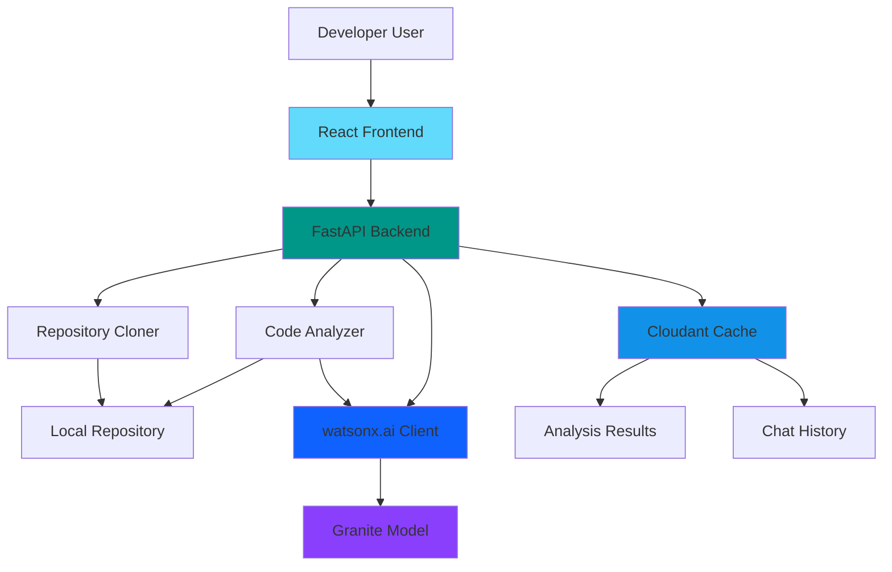
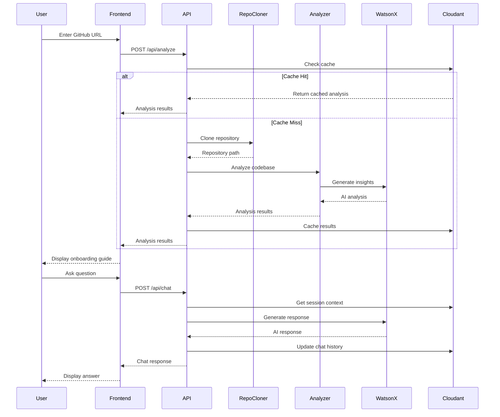
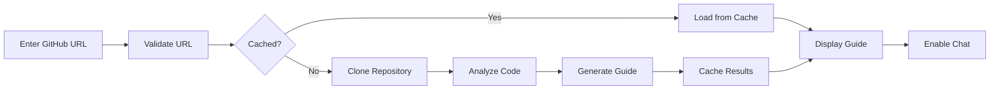
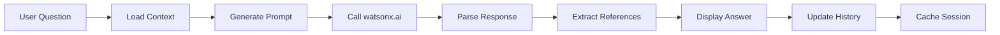

# DevOnboard AI - Architecture & Development Guide

## 🎯 Project Overview

**DevOnboard AI** is an intelligent developer onboarding assistant that streamlines the process of understanding new codebases. It clones GitHub repositories, performs deep analysis using IBM watsonx.ai Granite models, and provides an interactive chat interface where developers can explore and learn about the codebase through natural language conversations.

### Key Features
- 🔄 Automated GitHub repository cloning and analysis
- 🧠 AI-powered codebase understanding using watsonx.ai Granite models
- 💬 Context-aware chat interface with file-specific references
- 📊 Comprehensive onboarding guide generation
- 💾 Intelligent caching with IBM Cloudant
- 🚀 IBM Cloud-ready architecture with local development support

---

## 🏗️ System Architecture

### High-Level Architecture



### Component Interaction Flow



---

## 🛠️ Technology Stack

### Backend
- **Framework**: FastAPI 0.104+
  - High-performance async API framework
  - Automatic OpenAPI documentation
  - Built-in validation with Pydantic
  
- **AI/ML**: IBM watsonx.ai
  - Model: Granite (ibm/granite-13b-chat-v2 or similar)
  - Purpose: Code analysis, documentation generation, Q&A
  
- **Database**: IBM Cloudant
  - NoSQL document database
  - Caching layer for analysis results
  - Session and chat history storage
  
- **Repository Management**: GitPython
  - Clone and manage Git repositories
  - Extract repository metadata

- **Code Analysis**: 
  - `tree-sitter` - Syntax tree parsing
  - `radon` - Code complexity metrics
  - `pygments` - Syntax highlighting and language detection

### Frontend
- **Framework**: React 18+
  - Component-based UI architecture
  - Hooks for state management
  
- **UI Library**: Material-UI (MUI) or Tailwind CSS
  - Modern, responsive design
  - Pre-built components
  
- **State Management**: React Context API / Zustand
  - Global state for chat history
  - Session management
  
- **HTTP Client**: Axios
  - API communication
  - Request/response interceptors

- **Markdown Rendering**: react-markdown
  - Display formatted onboarding guides
  - Code syntax highlighting

### Development & Deployment
- **Local Development**: 
  - Docker Compose for service orchestration
  - Hot reload for both frontend and backend
  
- **IBM Cloud Ready**:
  - Cloud Foundry or Code Engine deployment
  - Cloudant as managed service
  - watsonx.ai API integration

---

## 📁 Project Structure

```
ibm-hackathon/
├── backend/
│   ├── __init__.py
│   ├── api.py                    # FastAPI application & routes
│   ├── analyzer.py               # Code analysis logic
│   ├── watsonx_client.py         # watsonx.ai integration
│   ├── cloudant_client.py        # Cloudant database operations
│   ├── repo_manager.py           # Git repository operations
│   ├── models.py                 # Pydantic models
│   ├── config.py                 # Configuration management
│   ├── utils.py                  # Utility functions
│   ├── requirements.txt          # Python dependencies
│   ├── .env.example              # Environment variables template
│   └── tests/
│       ├── test_api.py
│       ├── test_analyzer.py
│       └── test_watsonx.py
│
├── frontend/
│   ├── public/
│   │   ├── index.html
│   │   └── favicon.ico
│   ├── src/
│   │   ├── components/
│   │   │   ├── RepositoryInput.jsx    # GitHub URL input
│   │   │   ├── OnboardingGuide.jsx    # Display analysis results
│   │   │   ├── ChatInterface.jsx      # Chat UI
│   │   │   ├── CodeReference.jsx      # File/code snippets
│   │   │   └── LoadingSpinner.jsx     # Loading states
│   │   ├── services/
│   │   │   └── api.js                 # API client
│   │   ├── context/
│   │   │   └── AppContext.jsx         # Global state
│   │   ├── hooks/
│   │   │   ├── useAnalysis.js
│   │   │   └── useChat.js
│   │   ├── utils/
│   │   │   └── helpers.js
│   │   ├── App.jsx                    # Main application
│   │   ├── index.jsx                  # Entry point
│   │   └── styles/
│   │       └── main.css
│   ├── package.json
│   └── vite.config.js / webpack.config.js
│
├── docker-compose.yml            # Local development setup
├── Dockerfile.backend            # Backend container
├── Dockerfile.frontend           # Frontend container
├── .gitignore
├── README.md                     # Project overview
├── AGENTS.md                     # This file
└── docs/
    ├── API.md                    # API documentation
    ├── DEPLOYMENT.md             # Deployment guide
    └── DEVELOPMENT.md            # Development setup
```

---

## 🔌 API Endpoints

### Repository Analysis

#### `POST /api/analyze`
Analyze a GitHub repository and generate onboarding guide.

**Request Body:**
```json
{
  "repo_url": "https://github.com/username/repository",
  "branch": "main",
  "force_refresh": false
}
```

**Response:**
```json
{
  "session_id": "uuid-v4",
  "repository": {
    "name": "repository",
    "owner": "username",
    "url": "https://github.com/username/repository",
    "branch": "main",
    "last_commit": "abc123"
  },
  "analysis": {
    "overview": "Project description...",
    "tech_stack": ["Python", "FastAPI", "React"],
    "file_structure": {...},
    "key_files": [...],
    "dependencies": {...},
    "setup_instructions": "...",
    "architecture_insights": "..."
  },
  "cached": false,
  "analyzed_at": "2026-05-16T09:00:00Z"
}
```

### Chat Interface

#### `POST /api/chat`
Send a message and get AI-powered response about the codebase.

**Request Body:**
```json
{
  "session_id": "uuid-v4",
  "message": "How does authentication work in this project?",
  "context": {
    "file_path": "backend/auth.py",
    "line_range": [10, 50]
  }
}
```

**Response:**
```json
{
  "response": "Authentication in this project uses JWT tokens...",
  "references": [
    {
      "file": "backend/auth.py",
      "lines": [15, 30],
      "snippet": "def authenticate_user(...)..."
    }
  ],
  "timestamp": "2026-05-16T09:05:00Z"
}
```

#### `GET /api/chat/history/{session_id}`
Retrieve chat history for a session.

**Response:**
```json
{
  "session_id": "uuid-v4",
  "messages": [
    {
      "role": "user",
      "content": "How does authentication work?",
      "timestamp": "2026-05-16T09:05:00Z"
    },
    {
      "role": "assistant",
      "content": "Authentication uses JWT tokens...",
      "references": [...],
      "timestamp": "2026-05-16T09:05:02Z"
    }
  ]
}
```

### File Operations

#### `GET /api/files/{session_id}`
Get file tree for analyzed repository.

#### `GET /api/files/{session_id}/content`
Get content of a specific file.

**Query Parameters:**
- `path`: File path relative to repository root

---

## 💾 Data Models

### Cloudant Collections

#### `repository_analysis`
Stores cached analysis results.

```json
{
  "_id": "repo_hash_branch",
  "type": "analysis",
  "repo_url": "https://github.com/username/repository",
  "branch": "main",
  "analysis": {...},
  "created_at": "2026-05-16T09:00:00Z",
  "expires_at": "2026-05-23T09:00:00Z"
}
```

#### `chat_sessions`
Stores chat history per session.

```json
{
  "_id": "session_uuid",
  "type": "chat_session",
  "repo_url": "https://github.com/username/repository",
  "messages": [...],
  "created_at": "2026-05-16T09:00:00Z",
  "last_activity": "2026-05-16T09:15:00Z"
}
```

---

## 🧠 AI Integration Details

### watsonx.ai Configuration

**Model Selection:**
- Primary: `ibm/granite-3-8b-instruct` (general purpose instruction model)
- Alternative: `ibm/granite-8b-code-instruct` (specialized for code analysis)
- Alternative: `meta-llama/llama-3-3-70b-instruct` (larger model for complex tasks)

**Prompt Templates:**

#### Repository Analysis Prompt
```
You are an expert software architect analyzing a codebase for developer onboarding.

Repository: {repo_name}
Files analyzed: {file_count}
Primary languages: {languages}

File structure:
{file_tree}

Key files content:
{key_files_content}

Dependencies:
{dependencies}

Generate a comprehensive onboarding guide including:
1. Project overview and purpose
2. Technology stack explanation
3. Architecture overview
4. Setup instructions
5. Key components and their interactions
6. Development workflow
7. Important files and their purposes

Format the response in markdown.
```

#### Chat Prompt
```
You are a helpful AI assistant helping a developer understand a codebase.

Repository context:
{repository_overview}

Current file context (if provided):
{file_context}

Chat history:
{chat_history}

User question: {user_message}

Provide a clear, concise answer. If referencing specific code, include file paths and line numbers.
```

### Inference Parameters
```python
{
    "model_id": "ibm/granite-3-8b-instruct",
    "parameters": {
        "max_new_tokens": 2048,
        "temperature": 0.7,
        "top_p": 0.9,
        "top_k": 50,
        "repetition_penalty": 1.1
    }
}
```

### Available Models in watsonx.ai
The following models are supported in the current environment:
- **Granite Models**: `ibm/granite-3-8b-instruct`, `ibm/granite-8b-code-instruct`, `ibm/granite-3-1-8b-base`
- **Llama Models**: `meta-llama/llama-3-3-70b-instruct`, `meta-llama/llama-3-1-8b`
- **Mistral Models**: `mistral-large-2512`, `mistralai/mistral-small-3-1-24b-instruct-2503`

---

## 🔧 Configuration

### Environment Variables

**Backend (`.env`):**
```bash
# watsonx.ai Configuration
WATSONX_API_KEY=your_api_key_here
WATSONX_PROJECT_ID=your_project_id
WATSONX_URL=https://us-south.ml.cloud.ibm.com

# Cloudant Configuration
CLOUDANT_URL=https://your-instance.cloudantnosqldb.appdomain.cloud
CLOUDANT_API_KEY=your_cloudant_api_key
CLOUDANT_DATABASE=devonboard_cache

# Application Settings
REPO_CLONE_DIR=/tmp/repos
MAX_REPO_SIZE_MB=500
CACHE_TTL_DAYS=7
SESSION_TIMEOUT_HOURS=24

# API Settings
API_HOST=0.0.0.0
API_PORT=8000
CORS_ORIGINS=http://localhost:3000,http://localhost:5173

# Logging
LOG_LEVEL=INFO
```

**Frontend (`.env`):**
```bash
VITE_API_URL=http://localhost:8000
VITE_APP_NAME=DevOnboard AI
```

---

## 🚀 Development Plan

### Phase 1: Backend Foundation (Days 1-2)
1. **Setup FastAPI Application**
   - Initialize FastAPI project structure
   - Configure CORS and middleware
   - Setup logging and error handling
   - Create Pydantic models for requests/responses

2. **Implement watsonx.ai Client**
   - Create [`watsonx_client.py`](backend/watsonx_client.py)
   - Implement authentication
   - Create prompt templates
   - Add retry logic and error handling

3. **Implement Cloudant Client**
   - Create [`cloudant_client.py`](backend/cloudant_client.py)
   - Setup database connection
   - Implement CRUD operations
   - Add caching logic with TTL

### Phase 2: Repository Analysis (Days 2-3)
1. **Repository Manager**
   - Create [`repo_manager.py`](backend/repo_manager.py)
   - Implement Git cloning with GitPython
   - Add repository validation
   - Handle cleanup of temporary files

2. **Code Analyzer**
   - Create [`analyzer.py`](backend/analyzer.py)
   - Implement file tree generation
   - Add language detection
   - Extract dependencies from package files
   - Identify key files (README, main entry points)
   - Calculate code metrics

3. **Analysis Pipeline**
   - Integrate analyzer with watsonx.ai
   - Generate comprehensive onboarding guide
   - Cache results in Cloudant
   - Return structured analysis

### Phase 3: Chat Functionality (Days 3-4)
1. **Chat Endpoint**
   - Implement `/api/chat` endpoint
   - Session management
   - Context-aware prompting
   - File reference extraction

2. **Chat History**
   - Store conversations in Cloudant
   - Retrieve session history
   - Implement context window management

### Phase 4: Frontend Development (Days 4-5)
1. **React Application Setup**
   - Initialize React project with Vite
   - Setup routing
   - Configure API client
   - Create global state management

2. **Core Components**
   - [`RepositoryInput.jsx`](frontend/src/components/RepositoryInput.jsx) - URL input form
   - [`OnboardingGuide.jsx`](frontend/src/components/OnboardingGuide.jsx) - Display analysis
   - [`ChatInterface.jsx`](frontend/src/components/ChatInterface.jsx) - Chat UI
   - [`CodeReference.jsx`](frontend/src/components/CodeReference.jsx) - Code snippets

3. **Integration**
   - Connect frontend to backend APIs
   - Implement loading states
   - Add error handling
   - Style with UI library

### Phase 5: Testing & Polish (Days 5-6)
1. **Backend Testing**
   - Unit tests for core functions
   - Integration tests for API endpoints
   - Mock watsonx.ai and Cloudant

2. **Frontend Testing**
   - Component tests
   - Integration tests
   - E2E testing with Playwright/Cypress

3. **Documentation**
   - API documentation
   - Setup instructions
   - Deployment guide

### Phase 6: Deployment Preparation (Day 6)
1. **Local Development**
   - Create Docker Compose setup
   - Test full stack locally

2. **IBM Cloud Configuration**
   - Prepare Cloud Foundry manifest
   - Configure Cloudant service binding
   - Setup environment variables
   - Create deployment scripts

---

## 🎨 User Experience Flow

### 1. Repository Analysis


### 2. Chat Interaction


---

## 🔒 Security Considerations

1. **API Key Management**
   - Store credentials in environment variables
   - Never commit `.env` files
   - Use IBM Cloud secrets management in production

2. **Repository Access**
   - Validate GitHub URLs
   - Limit repository size
   - Sanitize file paths
   - Implement rate limiting

3. **Data Privacy**
   - Don't store sensitive code permanently
   - Implement session expiration
   - Clear temporary repositories
   - GDPR compliance for chat history

4. **Input Validation**
   - Validate all user inputs
   - Sanitize file paths
   - Prevent code injection
   - Rate limit API calls

---

## 📊 Performance Optimization

1. **Caching Strategy**
   - Cache analysis results for 7 days
   - Invalidate on repository updates
   - Use Cloudant indexes for fast lookups

2. **Repository Analysis**
   - Limit file size for analysis
   - Skip binary files
   - Parallel file processing
   - Incremental analysis for large repos

3. **AI Inference**
   - Batch similar requests
   - Implement request queuing
   - Use streaming responses for chat
   - Cache common questions

4. **Frontend**
   - Lazy load components
   - Virtualize long lists
   - Debounce user inputs
   - Optimize bundle size

---

## 🧪 Testing Strategy

### Backend Tests
```python
# tests/test_analyzer.py
def test_analyze_repository():
    """Test repository analysis pipeline"""
    pass

def test_cache_hit():
    """Test Cloudant cache retrieval"""
    pass

def test_watsonx_integration():
    """Test watsonx.ai API calls"""
    pass
```

### Frontend Tests
```javascript
// tests/ChatInterface.test.jsx
describe('ChatInterface', () => {
  it('sends message and displays response', () => {
    // Test implementation
  });
});
```

---

## 📈 Future Enhancements

1. **Multi-Repository Support**
   - Compare multiple repositories
   - Cross-repository search
   - Dependency graph visualization

2. **Advanced Analysis**
   - Security vulnerability scanning
   - Code quality metrics
   - Performance bottleneck detection
   - Architecture diagram generation

3. **Collaboration Features**
   - Team onboarding sessions
   - Shared annotations
   - Knowledge base building

4. **IDE Integration**
   - VSCode extension
   - IntelliJ plugin
   - CLI tool

---

## 🤝 Contributing

This project is built for the IBM Hackathon. For development:

1. Clone the repository
2. Follow setup instructions in [`DEVELOPMENT.md`](docs/DEVELOPMENT.md)
3. Create feature branches
4. Submit pull requests with clear descriptions

---

## 📝 License

[Specify license - e.g., MIT, Apache 2.0]

---

## 🆘 Support

For issues or questions:
- Create GitHub issues
- Contact: [Your contact information]
- IBM watsonx.ai documentation: https://www.ibm.com/docs/en/watsonx-as-a-service

---

**Last Updated**: 2026-05-16
**Version**: 1.0.0
**Status**: In Development